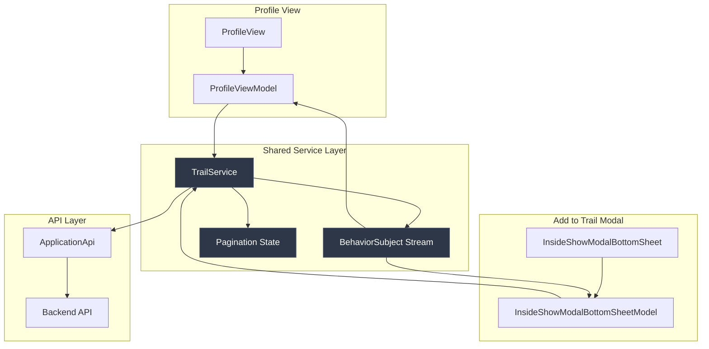

# Trails Paginate When Listing Trails

## Implementation Progress

| Step | Status     | Description                                              |
|------|------------|----------------------------------------------------------|
| 1    | ✅ Complete | Update ApplicationApi with Pagination Parameters         |
| 2    | ✅ Complete | Extend TrailService with Pagination State Management     |
| 3    | ✅ Complete | Update ProfileViewModel with Scroll-Triggered Pagination |
| 4    | ✅ Complete | Update ProfileView with Pagination UI Elements           |
| 5    | ✅ Complete | Add Pagination Error Handling and Recovery               |
| 6    | ✅ Complete | Make TrailService Support Multiple Stream Consumers      |
| 7    | ✅ Complete | Add Scroll-Triggered Pagination to Modal ViewModel      |
| 8    | ✅ Complete | Update Modal View with Pagination UI Elements           |

## Why

Currently, both the trail list view in the profile section and the "add experience to trail" modal load all user trails at once through the
`TrailService.initUserTrails()` method, which returns a complete list of trails without any pagination support. This approach fetches all trails in a single API call, as seen in the
`ApplicationApi.getUserTrails()` method that calls the
`/trails` endpoint and processes all entries at once. The existing
`ProfileViewModel` and `InsideShowModalBottomSheetModel` manage trails through a simple
`List<Trail>` structure with no consideration for pagination or incremental loading. Additionally, the current `initUserTrails()` implementation calls `loadTrailPage()` on every invocation, which causes issues when multiple consumers need access to the same trail data.

Thus, as the number of user trails grows, this approach will lead to performance issues including increased memory usage, slower initial load times, and potential network timeouts for users with large trail collections across both views. The current implementation also provides a poor user experience with longer loading times and no progressive content display in either the profile view or the modal. The multiple consumer issue means that trail data is fetched redundantly when both views are active simultaneously. However, the backend already supports cursor-based pagination through
`page_size` and
`page_token` parameters in the trails controller, which the mobile app is not currently utilizing efficiently.

Expectedly, implementing proper pagination support for both views will improve application performance by reducing memory footprint, decrease initial load times through incremental content loading, and provide better user experience with immediate content display. The implementation will also reduce server load and network bandwidth usage while maintaining compatibility with existing trail management functionality, providing smooth scroll-triggered pagination in both contexts, and ensuring efficient stream sharing between multiple consumers.

## Implementation

The implementation will follow a layered approach, extending existing pagination patterns found in the
`DiscoveryService` and utilizing the existing
`Pagination` model. The solution will integrate with the current
`TrailService` and
`ProfileViewModel` architecture while maintaining existing UI patterns.



### Step 1: Update ApplicationApi with Pagination Parameters

Extend the existing
`getUserTrails()` method to accept optional pagination parameters and modify response parsing to extract pagination tokens, following the established pattern used in
`getDiscovery()` and `getTopicExperiences()` methods.

#### ApplicationApi Interfaces

```dart
Future<ApplicationApiResponse<List<Trail>>> getUserTrails({
  int? pageSize,
  String? pageToken
});
```

#### ApplicationApi Implementation

1. Add optional `pageSize` and `pageToken` parameters to existing
   `getUserTrails` method signature
2. Modify request logic to include `page_size` and
   `page_token` as query parameters when parameters provided
3. Update response parsing to handle paginated format with `entries` and
   `pagination` fields
4. Extract
   `next_page_token` from response and expose through method return or callback mechanism
5. Maintain existing
   `ApplicationApiResponse<List<Trail>>` return type for backward compatibility

### Step 2: Extend TrailService with Pagination State Management

Add pagination state tracking to
`TrailService` using the existing stream controller pattern, following the approach established in
`DiscoveryService` for managing page tokens and accumulated results.

#### TrailService Interfaces

```dart
class TrailService {
  Future<void> loadNextTrailPage();
  Stream<ApplicationApiResponse<List<Trail>>> getUserTrails();
  Future<void> refreshTrails();
  bool get hasMoreTrails;
  bool get isLoadingTrails;
}
```

#### TrailService Implementation

1. Add `String? _nextPageToken` and `List<Trail> _trails` state variables
2. Implement `loadNextTrailPage` method using
   `getUserTrails` with stored pagination token
3. Modify stream controller to emit trails list after each page load
4. Update `refreshTrails` method to reset pagination state and reload first page
5. Add computed properties for `hasMoreTrails` based on token presence and
   `isLoadingTrails` state

### Step 3: Update ProfileViewModel with Scroll-Triggered Pagination

Integrate pagination capabilities into
`ProfileViewModel` by adding scroll detection and pagination trigger logic, following the pattern established in
`DiscoverModel` for infinite scroll implementation.

#### ProfileViewModel Interfaces

```dart
class ProfileViewModel extends BaseModel {
  bool get isLoadingMoreTrails;
  bool get hasMoreTrails;
  Future<void> loadMoreTrails();
  ScrollController get trailScrollController;
}
```

#### ProfileViewModel Implementation

1. Add scroll controller with listener for pagination trigger detection
2. Implement scroll position calculation logic similar to
   `DiscoverModel._updateDiscoverScrollState`
3. Add `loadMoreTrails` method that delegates to
   `TrailService.loadNextTrailPage`
4. Include loading state management with `isLoadingMoreTrails` property
5. Expose `hasMoreTrails` property from underlying service

### Step 4: Update ProfileView with Pagination UI Elements

Enhance the trail list widget to display loading indicators and handle pagination states, integrating with the existing
`SliverGrid` layout and maintaining the current trail card design.

#### ProfileView UI Interfaces

```dart
Widget _buildTrailGridWithPagination(List<Trail> trails, ProfileViewModel model);
Widget _buildPaginationLoadingIndicator();
Widget _buildEndOfListIndicator();
```

#### ProfileView UI Implementation

1. Modify existing `SliverGrid` to include conditional pagination indicators in
   `SliverList`
2. Add loading indicator widget using existing `CircularProgressBar` component
3. Implement scroll listener integration with
   `ProfileViewModel` pagination logic
4. Include error state handling with retry functionality
5. Maintain existing trail card layout and spacing

### Step 5: Add Pagination Error Handling and Recovery

Implement comprehensive error handling for pagination failures using existing error response patterns from
`ApplicationApiResponse` and `BaseResponse` structures.

#### Error Handling Implementation

1. Integrate error handling using existing `ApplicationApiResponse.result` and
   `statusCode` patterns
2. Display localized error messages for failed pagination requests using `AppLocalizations`
3. Provide manual retry button that allows user to attempt pagination again
4. Handle edge cases for empty responses and network timeouts
5. Maintain existing trails and app functionality when pagination errors occur
6. Ensure error propagation works for all pagination scenarios (initial load and subsequent pages)

### Step 6: Make TrailService Support Multiple Stream Consumers

Modify `TrailService` to efficiently handle multiple consumers accessing the same trail data stream without redundant API calls.

#### Multi-Consumer Interfaces

```dart
class TrailService {
  Stream<ApplicationApiResponse<List<Trail>>> get trailsStream;
  Future<void> initUserTrails();
  bool get isInitialized;
}
```

#### Implementation

1. Modify `initUserTrails()` to be idempotent and safe for multiple calls
2. Add `_isInitialized` flag to track initialization state
3. Only call `loadTrailPage()` on first initialization, subsequent calls return existing stream
4. Ensure `BehaviorSubject` properly broadcasts current state to new subscribers
5. Add proper disposal handling to prevent memory leaks from multiple subscriptions

### Step 7: Add Scroll-Triggered Pagination to Modal ViewModel

Integrate pagination capabilities into `InsideShowModalBottomSheetModel` by adding scroll detection and pagination trigger logic, following the pattern established in `ProfileViewModel`.

#### Modal ViewModel Interfaces

```dart
class InsideShowModalBottomSheetModel {
  bool get isLoadingMoreTrails;
  bool get hasMoreTrails;
  Future<void> loadMoreTrails();
  ScrollController get trailScrollController;
}
```

#### Implementation

1. Add scroll controller with listener for pagination trigger detection
2. Implement scroll position calculation logic similar to `ProfileViewModel._updateTrailScrollState`
3. Add `loadMoreTrails` method that delegates to `TrailService.loadTrailPage`
4. Include loading state management with `isLoadingMoreTrails` property
5. Expose `hasMoreTrails` property from underlying service

### Step 8: Update Modal View with Pagination UI Elements

Enhance the trail list widget in `InsideShowModalBottomSheet` to display loading indicators and handle pagination states, integrating with the existing `ListView.builder` layout.

#### Modal View UI Interfaces

```dart
Widget _buildPaginationIndicator(BuildContext context, InsideShowModalBottomSheetModel model);
Widget _buildTrailListWithPagination(List<Trail> trails, InsideShowModalBottomSheetModel model);
```

#### Implementation

1. Modify existing `ListView.builder` to include conditional pagination indicators
2. Add loading indicator widget using existing `RefreshProgressIndicator` component
3. Implement scroll listener integration with `InsideShowModalBottomSheetModel` pagination logic
4. Include error state handling with retry functionality using localized strings
5. Maintain existing trail card layout and spacing within modal constraints
